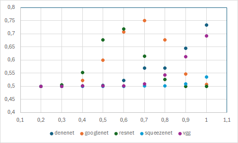
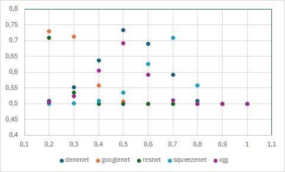

# Face re-identification

<p>
  <a href="https://github.com/Michal-Koter/face-reidentification/graphs/contributors">
    
  </a>
  <a href="">
    
  </a>
  <a href="">
    
  </a>

</p>

## About the Project

The use of facial images has become a popular method of identity authentication. It is also being used to create albums
of photos featuring a person on popular cloud services. But how do weave networks trained on the ImageNet collection
handle facial recognition?

I check how pretreated models handle this task by two methods.

1. Convert the output of the encoder into a vector and compare it with the other vector using different distance
   functions.
2. Fine-tune the model by training the classifier

## Installation

```bash
git clone https://github.com/Michal-Koter/face-reidentification.git
cd face-reidentification
poetry install
```

Then you will be able to import the library and use its functionalities.

```python
import face_reidentification as fr
```

### Use pretrained encoder and compare vectors

```python
encoders = ["densenet", "googlenet", "resnet", "squeezenet", "vgg"]
distance_functions = ["euclidean", "euclidean_l2", "cosine"]

result = fr.verification(
    img1_path=img1_path,
    img2_path=img2_path,
    encoder_name=encoders[1],
    distance_name=distance_functions[2],
    threshold=0.2
)
```

### Use fine-tuned model

```python
architecture = ["densenet", "googlenet", "resnet", "squeezenet", "vgg"]

result = fr.use(
    img1_path=img1_path,
    img2_path=img1_path,
    model_name=encoders[0],
)
```

## Datasets

The dataset [Labeled Faces in the Wild](https://vis-www.cs.umass.edu/lfw/).

### About dataset:

* 13233 images of 5749 people
* image format JPG
* original image size 250x250px cropped to 200x200px

## Used architectures

* DenseNet
* GoogLeNet
* ResNet
* SqueezeNet
* VGG-16

## Methodology

### Comparing the output of the encoders

1. Encode image using one of pretrained encoder and flatten it to vector.
2. Compare two vector using of distance functions:
    * Euclidean distance
    * Euclidean distance with L2 normalization
    * Cosine similarity
3. Checking if the distance of vectors, is less than the threshold.

### Fine-tuned models

1. Train binary classifier evaluate with Cross Entropy Loss.
2. Checking metrics on a test set.

## Results

### Comparing the output of the encoders

For the first approach, the results using Euclidean distance give a result close
to random for the test set. It is better when using L2 normalization, but I obtained satisfactory results only at a
threshold above 0.5. The best performance is in the comparison of vectors using cosine similarity, where already at a
threshold of 0.2 I obtained an accuracy result is above 0.7 for two encoders.


Fig 1A: Effect of threshold (X axis) on accuracy (Y axis) for Euclidean distance with L2 normalization.


Fig 1B: Effect of threshold value (X axis) on accuracy (Y axis) for cosine similarity.

### Fine-tuning

On the second approach, I ultimately failed to train correctly. While the network was able to learn the
training cases perfectly, on the test set the accuracy was close to a random answer.

## Hardware used during the project

* Intel Core i5 9th Gen
* Nvidia GeForce RTX2060
* 32GB RAM

## Contributors

<a href="https://github.com/Michal-Koter/face-reidentification/graphs/contributors">
  
</a>

## Contact

[Michał Koter](https://www.linkedin.com/in/michal-koter/)
